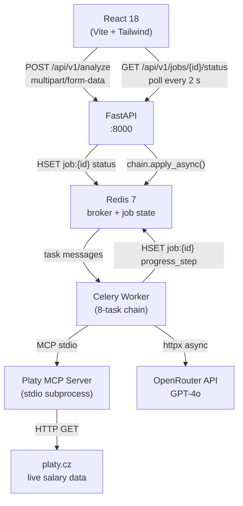
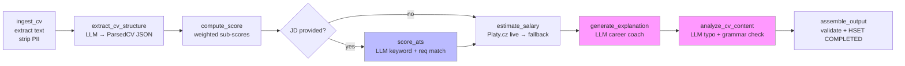

# Job Fit & Salary Estimator

A portfolio project that analyses English-language CVs against the Czech IT job market. Upload a PDF or DOCX, optionally paste a job description, and receive a seniority score (0–100), a CZK salary range sourced live from Platy.cz, ATS keyword coverage, CV quality feedback, and a structured career coaching explanation — all generated by GPT-4o through a Celery pipeline.

---

## Features

- **CV ingestion** — PDF and DOCX, up to 10 MB, validated from magic bytes (not just extension)
- **LLM-based CV structuring** — GPT-4o extracts experience, skills, education, and role titles from free-form text
- **Seniority scoring (0–100)** — weighted sub-scores for experience, skills, education, and role seniority; configurable via YAML
- **ATS scoring** — when a job description is provided, keyword coverage and requirement matching are computed against the JD
- **Live salary estimation** — Platy.cz data scraped in real time; interpolated by role and seniority tier; fallback to YAML bands if the scrape fails
- **Career coaching explanation** — GPT-4o produces a summary, 3 strengths, 2 weaknesses, and 5 prioritised recommendations
- **CV content analysis** — detects typos, grammar issues, missing sections, and repetition
- **Async pipeline** — Celery task chain with per-step progress reporting; frontend polls via React Query
- **Partial results** — explanation and ATS steps are non-critical; score and salary are always returned on success
- **PII stripping** — contact details are scrubbed before any text is sent to the LLM

---

## Architecture

### System overview



### 8-task pipeline



> Steps in pink are non-critical — if they fail the pipeline continues and returns a PARTIAL result. The ATS step (blue) is skipped entirely when no job description is provided.

---

## Tech Stack

| Layer | Technology | Version |
|-------|-----------|---------|
| Backend framework | FastAPI | >=0.111 |
| ASGI server | Uvicorn | >=0.29 |
| Task queue | Celery + Redis broker | >=5.4 |
| Job state store | Redis | 7.x |
| Data validation | Pydantic v2 | >=2.7 |
| LLM gateway | OpenRouter (GPT-4o) | — |
| HTTP client | httpx | >=0.27 |
| PDF extraction | pdfplumber | >=0.10 |
| DOCX extraction | python-docx | >=1.1 |
| MIME validation | python-magic + libmagic | >=0.4 |
| MCP server SDK | FastMCP (mcp package) | >=1.0 |
| Salary data | Platy.cz (live scrape + YAML fallback) | — |
| Logging | structlog | >=24.0 |
| Frontend framework | React 18 | ^18.3 |
| Build tool | Vite | ^5.3 |
| CSS | Tailwind CSS | ^3.4 |
| API state + polling | TanStack React Query | ^5.40 |
| Charts | Recharts | ^2.12 |
| Python package manager | uv | latest |
| Node package manager | pnpm | v9+ |
| Containers | Docker Compose | — |

---

## Prerequisites

| Tool | Version | Notes |
|------|---------|-------|
| Python | 3.12+ | Minimum; 3.11 not supported |
| uv | latest | `curl -LsSf https://astral.sh/uv/install.sh \| sh` |
| Node | 20 LTS | Build only |
| pnpm | 9+ | `npm install -g pnpm` |
| Docker | 24+ | For Redis; Docker Compose included |
| libmagic | any | Required by python-magic (see below) |
| OpenRouter API key | — | Free account at [openrouter.ai](https://openrouter.ai) |

### Install libmagic

```bash
# macOS
brew install libmagic

# Debian / Ubuntu
sudo apt-get install libmagic1

# Alpine (Docker)
apk add --no-cache libmagic
```

If `libmagic` is unavailable, the application starts with a warning and falls back to file-extension-only validation.

---

## Installation

### 1. Clone and enter the repository

```bash
git clone git@github.com:rgoldberg-personal/resume-checker.git resume_checker_app
cd resume_checker_app
```

### 2. Install Python dependencies

```bash
# Creates .venv and installs all runtime + dev dependencies
uv sync
```

### 3. Install frontend dependencies

```bash
cd frontend
pnpm install
cd ..
```

### 4. Start Redis

```bash
docker compose up redis -d
```

### 5. Configure environment variables

```bash
cp .env.example .env
# Open .env and set OPENROUTER_API_KEY
```

See the [Configuration](#configuration) section for all available variables.

### 6. (Optional) Refresh live salary data

The MCP server reads from `platy_mcp/data/salary_data.json`. Refresh it at any time:

```bash
uv run python platy_mcp/scraper.py
```

If the file is absent, the pipeline falls back to `config/salary_bands.yaml` automatically.

---

## Running

Open three terminals (or use `docker compose up` to run everything together).

### Terminal 1 — FastAPI backend

```bash
uv run uvicorn app.main:app --reload --host 0.0.0.0 --port 8000
```

### Terminal 2 — Celery worker

```bash
uv run celery -A app.celery_app worker --loglevel=info --concurrency=2
```

The worker spawns the Platy MCP server as a stdio subprocess on startup.

### Terminal 3 — React frontend

```bash
cd frontend
pnpm dev
```

The UI is available at [http://localhost:5173](http://localhost:5173). API calls are proxied to `:8000` via the Vite dev server config.

### All-in-one with Docker Compose

```bash
docker compose up
```

Starts Redis, backend, Celery worker, and frontend together. Add `--profile monitoring` to also launch the Flower task UI on port 5555.

```bash
docker compose --profile monitoring up
```

---

## Configuration

### `.env` variables

Copy `.env.example` to `.env` and fill in the required fields.

| Variable | Required | Default | Description |
|----------|----------|---------|-------------|
| `OPENROUTER_API_KEY` | **Yes** | — | OpenRouter API key — get one at openrouter.ai/keys |
| `OPENROUTER_BASE_URL` | No | `https://openrouter.ai/api/v1` | Override for a different LLM proxy |
| `OPENROUTER_MODEL` | No | `openai/gpt-4o` | Any model supported by OpenRouter |
| `LLM_TEMPERATURE` | No | `0.0` | 0.0 for deterministic output |
| `LLM_TIMEOUT_SECONDS` | No | `30` | Per-call LLM timeout |
| `REDIS_URL` | No | `redis://localhost:6379/0` | Redis connection string |
| `BACKEND_HOST` | No | `0.0.0.0` | FastAPI bind host |
| `BACKEND_PORT` | No | `8000` | FastAPI bind port |
| `FRONTEND_URL` | No | `http://localhost:5173` | Allowed CORS origin |
| `UPLOAD_DIR` | No | `/tmp/uploads` | Absolute path for temporary CV files |
| `MAX_FILE_SIZE_BYTES` | No | `10485760` | 10 MB |
| `MAX_CONCURRENT_JOBS` | No | `5` | Concurrent analysis limit (429 beyond this) |
| `LLM_CACHE_ENABLED` | No | `false` | Cache LLM responses by CV text SHA-256 |
| `LLM_CACHE_TTL_SECONDS` | No | `86400` | Cache TTL (24 hours) |
| `LOG_LEVEL` | No | `INFO` | `DEBUG`, `INFO`, `WARNING`, or `ERROR` |
| `APP_VERSION` | No | `1.0.0` | Shown in health check |

### `.env.example`

```bash
# Required
OPENROUTER_API_KEY=sk-or-v1-your-key-here

# LLM
OPENROUTER_BASE_URL=https://openrouter.ai/api/v1
OPENROUTER_MODEL=openai/gpt-4o
LLM_TEMPERATURE=0.0
LLM_TIMEOUT_SECONDS=30

# Redis
REDIS_URL=redis://localhost:6379/0

# Server
BACKEND_HOST=0.0.0.0
BACKEND_PORT=8000
FRONTEND_URL=http://localhost:5173

# File handling
UPLOAD_DIR=/tmp/uploads
MAX_FILE_SIZE_BYTES=10485760

# Pipeline
MAX_CONCURRENT_JOBS=5

# Cache (optional)
LLM_CACHE_ENABLED=false
LLM_CACHE_TTL_SECONDS=86400

# Logging
LOG_LEVEL=INFO
APP_VERSION=1.0.0
```

### YAML configuration files

| File | Purpose |
|------|---------|
| `config/scoring_weights.yaml` | Sub-score weights (must sum to 100); validated at startup |
| `config/salary_bands.yaml` | Fallback salary bands per role category and seniority tier |

Role classification is handled by the LLM during CV extraction — no static mapping file needed.

These files can be edited without changing any code. The application reads them at startup.

### Seniority tiers

Scores map to tiers used for salary lookup:

| Score range | Tier |
|-------------|------|
| 0–34 | junior |
| 35–59 | mid |
| 60–79 | senior |
| 80–100 | lead |

---

## API Endpoints

Base URL: `http://localhost:8000/api/v1`

Interactive docs: [http://localhost:8000/docs](http://localhost:8000/docs)

### `POST /api/v1/analyze`

Submit a CV for analysis.

**Request** — `multipart/form-data`

| Field | Type | Required | Description |
|-------|------|----------|-------------|
| `cv_file` | file | Yes | PDF or DOCX, max 10 MB |
| `job_description` | string | No | Job description text for ATS scoring |

**Response** — `202 Accepted`

```json
{
  "job_id": "3fa85f64-5717-4562-b3fc-2c963f66afa6",
  "status": "PENDING",
  "message": "Analysis started. Poll /api/v1/jobs/{job_id}/status for progress."
}
```

---

### `GET /api/v1/jobs/{job_id}/status`

Poll for job progress and results.

**Response — in progress**

```json
{
  "job_id": "3fa85f64-5717-4562-b3fc-2c963f66afa6",
  "status": "SCORING",
  "progress_step": "Computing seniority score...",
  "result": null,
  "warnings": [],
  "error_message": null
}
```

**Response — completed**

```json
{
  "job_id": "3fa85f64-5717-4562-b3fc-2c963f66afa6",
  "status": "COMPLETED",
  "progress_step": "Done",
  "result": {
    "seniority_score": 72,
    "score_breakdown": {
      "experience": 22,
      "skills": 24,
      "education": 14,
      "role_seniority": 12,
      "justifications": { "...": "..." }
    },
    "ats_result": {
      "ats_score": 68,
      "keyword_matches": [],
      "requirement_matches": [],
      "priority_gaps": [],
      "tailoring_suggestions": []
    },
    "salary_estimate": {
      "min_czk": 95000,
      "max_czk": 145000,
      "currency": "CZK",
      "period": "month",
      "confidence": "high",
      "data_source": "platy_cz_live",
      "seniority_tier": "senior",
      "role_category": "backend-developer"
    },
    "explanation": {
      "summary": "...",
      "strengths": ["...", "...", "..."],
      "weaknesses": ["...", "..."],
      "recommendations": ["...", "...", "...", "...", "..."]
    },
    "content_issues": [
      { "issue_type": "typo", "original": "managment", "fixed": "management" }
    ],
    "confidence": "high",
    "warnings": []
  },
  "warnings": [],
  "error_message": null
}
```

Terminal statuses: `COMPLETED`, `PARTIAL` (score/salary returned; explanation failed), `FAILED`.

---

### `GET /api/v1/health`

Service liveness check.

**Response — `200 OK`**

```json
{
  "status": "ok",
  "version": "1.0.0",
  "redis": "ok"
}
```

---

### Error format

All errors follow the same envelope:

```json
{
  "error": {
    "code": "UNSUPPORTED_FILE_TYPE",
    "message": "Only PDF and DOCX files are supported.",
    "details": null
  }
}
```

---

## Project Structure

```
resume_checker_app/
├── pyproject.toml              # Python project config (uv, ruff, mypy, pytest)
├── uv.lock                     # Pinned Python dependencies
├── .env.example                # Environment variable template
├── docker-compose.yml          # Local dev orchestration
├── Dockerfile.backend          # FastAPI + Celery image
│
├── app/
│   ├── main.py                 # FastAPI app, middleware, startup checks
│   ├── config.py               # pydantic-settings Settings class
│   ├── schemas.py              # All Pydantic models
│   ├── celery_app.py           # Celery instance and config
│   ├── pipeline.py             # chain() definition — 8-task sequence
│   ├── job_store.py            # Redis reads/writes for job state
│   ├── mcp_client.py           # MCP client session (stdio subprocess)
│   ├── routes/
│   │   ├── analyze.py          # POST /api/v1/analyze
│   │   ├── jobs.py             # GET /api/v1/jobs/{id}/status
│   │   └── health.py           # GET /api/v1/health
│   ├── tasks/
│   │   ├── ingest_cv.py        # Text extraction + PII stripping
│   │   ├── extract_cv_structure.py  # LLM → ParsedCV
│   │   ├── compute_score.py    # Weighted seniority scoring
│   │   ├── score_ats.py        # LLM ATS keyword + req match
│   │   ├── estimate_salary.py  # Platy.cz live + YAML fallback
│   │   ├── generate_explanation.py  # LLM career coaching
│   │   ├── analyze_cv_content.py    # LLM typo/grammar check
│   │   └── assemble_output.py  # Validate + write COMPLETED state
│   ├── llm/
│   │   ├── client.py           # httpx wrapper for OpenRouter
│   │   └── prompts.py          # All LLM prompt templates
│   └── utils/
│       ├── pdf_extractor.py    # pdfplumber text extraction
│       ├── docx_extractor.py   # python-docx text extraction
│       ├── pii_stripper.py     # Scrub names, emails, phones
│       ├── file_validator.py   # MIME type + size validation
│       └── salary_utils.py     # Platy.cz scraping + fallback bands
│
├── platy_mcp/
│   ├── server.py               # FastMCP entry point (stdio transport)
│   ├── tools.py                # @mcp.tool() salary lookup definitions
│   ├── scraper.py              # Platy.cz HTML scraper + data refresh script
│   └── data/
│       ├── salary_data.json    # Scraped salary data (refreshed manually)
│       └── roles.json          # Canonical role category list
│
├── config/
│   ├── scoring_weights.yaml    # Sub-score weights (must sum to 100)
│   └── salary_bands.yaml       # Fallback salary bands
│
├── frontend/
│   ├── package.json
│   ├── vite.config.ts          # Dev server with /api proxy to :8000
│   └── src/
│       ├── api/client.ts       # Typed API client
│       ├── components/         # UploadForm, ScoreGauge, SalaryRange, etc.
│       ├── hooks/useAnalysis.ts # React Query polling hook
│       ├── pages/AnalyzerPage.tsx
│       └── types/api.ts        # TypeScript types mirroring Pydantic models
│
└── tests/
    ├── unit/                   # Scoring, salary, PII, role mapping tests
    ├── integration/            # Endpoint and MCP tool tests
    └── conftest.py             # Shared fixtures (mock Redis, mock OpenRouter)
```

---

## How It Works

### Step 1 — `ingest_cv`

The uploaded file is written to `UPLOAD_DIR` as a temporary file. `python-magic` validates the MIME type from magic bytes; `pdfplumber` or `python-docx` extracts raw text. `pii_stripper` then replaces names, emails, phone numbers, and addresses with placeholders (`[name]`, `[email]`, etc.) before any text leaves the service.

### Step 2 — `extract_cv_structure`

The sanitised CV text is sent to GPT-4o with a structured extraction prompt. The LLM returns a JSON object with sections, a normalised skills list, total years of experience, education level, role titles, management indicators, and a role category slug (e.g., `backend-developer`). The response is validated against a Pydantic `ParsedCV` model.

### Step 3 — `compute_score`

Four sub-scores are calculated deterministically from the parsed CV data using configurable weights from `config/scoring_weights.yaml`:

| Sub-score | Max points | Basis |
|-----------|-----------|-------|
| Experience | 30 | Total years + role progression |
| Skills | 30 | Breadth, depth, and optional JD relevance |
| Education | 20 | Degree level and field relevance |
| Role seniority | 20 | Highest title + management indicators |

The LLM is also called here to produce per-category reasoning, gap analysis, and learning paths that feed into the explanation step.

### Step 4 — `score_ats` (conditional)

If a job description was provided, GPT-4o performs ATS analysis: it extracts keywords from the JD, checks each against the CV, maps explicit requirements to candidate evidence, and produces an ATS score (0–100) with priority gaps and tailoring suggestions. This step is skipped entirely when no JD is given.

### Step 5 — `estimate_salary`

The seniority score is mapped to a tier (junior / mid / senior / lead). The Platy MCP server is called via stdio to look up a salary range for the role category and tier from `platy_mcp/data/salary_data.json`. If the MCP lookup fails or returns no data, `salary_utils.fetch_live_salary` scrapes Platy.cz directly. If that also fails, the hardcoded bands in `config/salary_bands.yaml` are used. The final salary is sanity-checked against Czech market bounds (25,000–500,000 CZK/month).

### Step 6 — `generate_explanation`

GPT-4o receives the full score breakdown (including reasoning, gap analysis, and learning paths from step 3), the salary estimate, and a CV summary. It returns a JSON object with a summary (2–3 sentences), exactly 3 strengths (with scores), exactly 2 weaknesses (ordered by largest gap), and exactly 5 recommendations (3 short-term executable tasks, 2 long-term goals). This step is non-critical: if it fails, the pipeline moves to PARTIAL status.

### Step 7 — `analyze_cv_content`

GPT-4o reads the PII-stripped CV text and identifies concrete issues only: typos, grammar errors, missing sections, and repeated phrases. It never invents problems — if the CV is clean, it returns an empty issues list. This step is also non-critical.

### Step 8 — `assemble_output`

The accumulated context from all previous tasks is validated (score in 0–100, salary min < max, all required fields present), a confidence level (low / medium / high) is calculated, and the final `AnalysisResult` is written to Redis with `HSET job:{job_id} status COMPLETED`. The temporary CV file is deleted.

---

## Running Tests

```bash
# All backend tests
uv run pytest

# With coverage
uv run pytest --cov=app --cov-report=term-missing

# Lint and format check
uv run ruff check .
uv run ruff format --check .

# Type check
uv run mypy app/ platy_mcp/

# Frontend tests
cd frontend && pnpm test

# Frontend type check
cd frontend && pnpm exec tsc --noEmit
```

---

## Refreshing Salary Data

The MCP server serves data from `platy_mcp/data/salary_data.json`. This file is generated by scraping Platy.cz and can be refreshed without restarting the application (the MCP server reads the file on each tool call):

```bash
uv run python platy_mcp/scraper.py
```

The scraper fetches 18 IT role pages from Platy.cz with a 1-second delay between requests, extracts the p10–p90 salary range, interpolates four seniority tiers, and writes the results to `platy_mcp/data/salary_data.json`. Run this periodically (e.g., monthly) to keep salary data current.

---

## Startup Validation

The application refuses to start if any of the following checks fail:

| Check | Failure behaviour |
|-------|------------------|
| `OPENROUTER_API_KEY` is set and non-empty | Process exits with clear message |
| `UPLOAD_DIR` exists and is writable | Process exits; logs suggested `mkdir -p` command |
| Redis responds to `ping` | Process exits; logs the Redis URL |
| `scoring_weights.yaml` weights sum to 100 | Process exits; logs current values |
| `salary_bands.yaml` has valid min/max pairs | Process exits; logs which band is invalid |
| `libmagic` is importable | Warning only; falls back to extension validation |

The Celery worker additionally attempts to start the Platy MCP server subprocess on `worker_init`. If it fails, a warning is logged and salary estimation falls back to YAML bands for that worker process.
